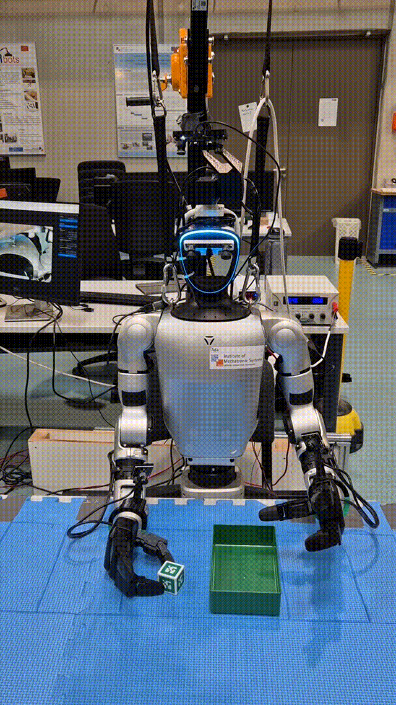
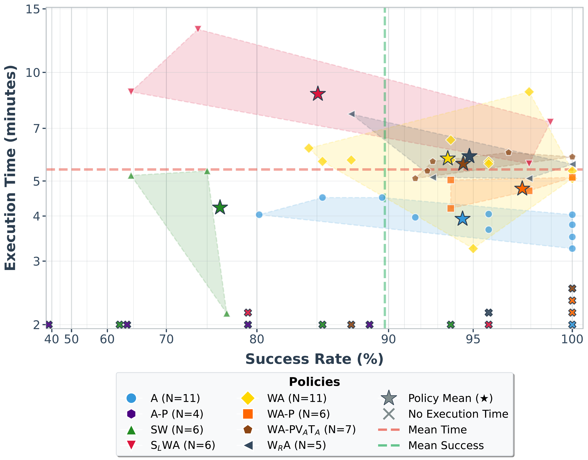
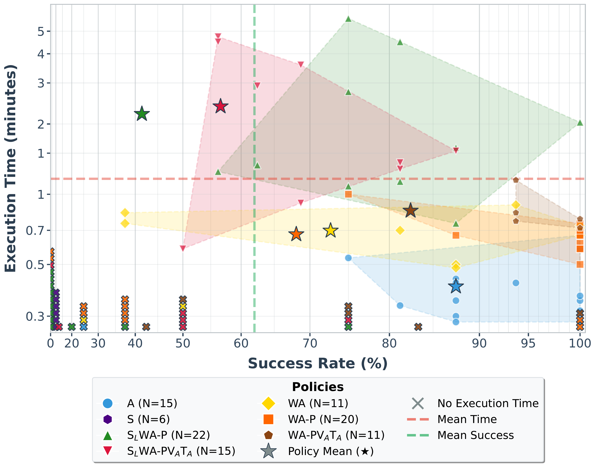
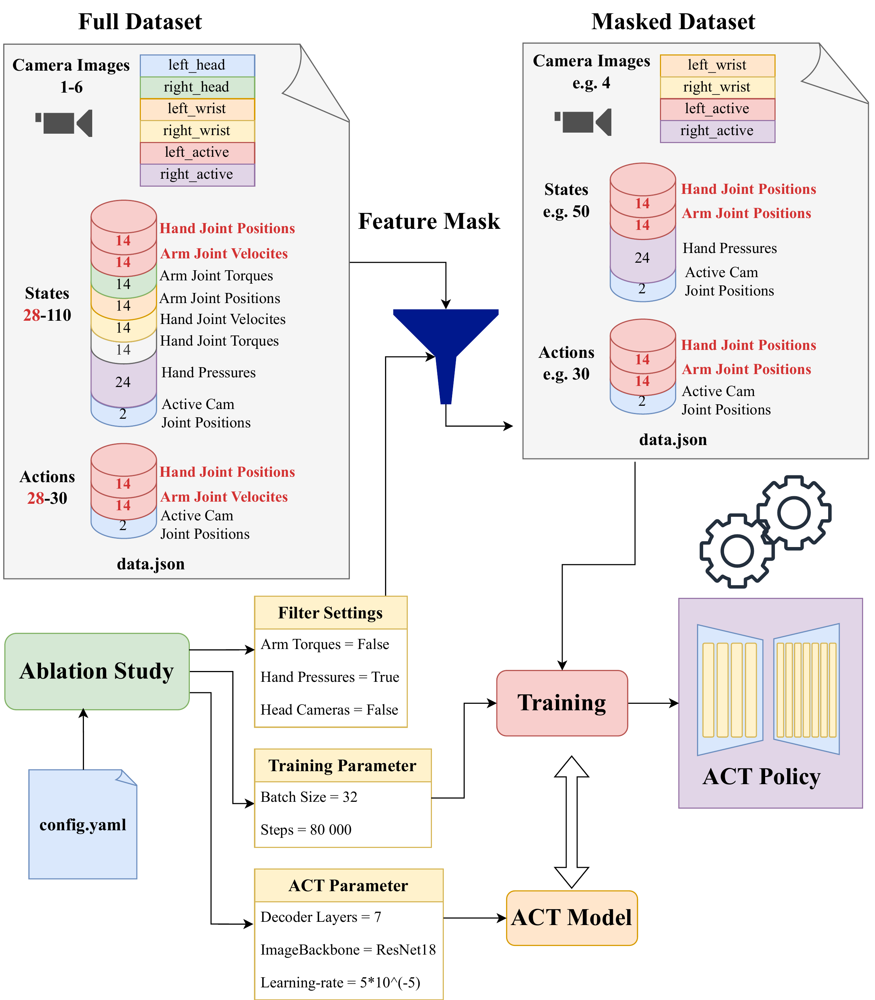
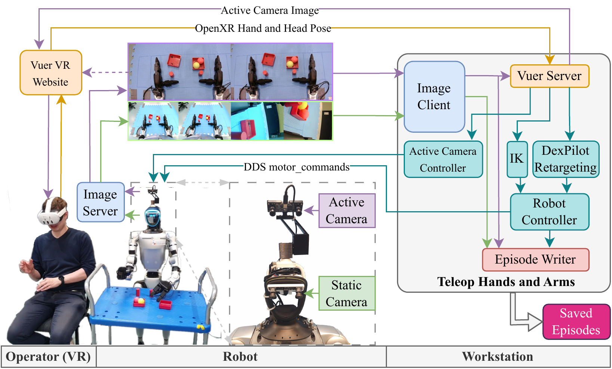

# More Is Not Always Better: Active Stereo Camera Setup Outperforms Multi-Sensor Setup in ACT Imitation Learning

[](LICENSE)
[]()
[]()

**Robin Kühn¹, Dennis Bank¹, Moritz Schappler¹, Thomas Seel¹**

¹Institute of Mechatronic Systems, Leibniz University Hannover, Germany

> **TL;DR**: We demonstrate that a minimal active stereo camera setup outperforms complex multi-sensor arrays for humanoid manipulation with Action Chunking Transformers (ACT), achieving 87.5% success in spatial generalization tasks. Our **Unified Ablation Framework** enables rigorous sensor comparison by training all policies on identical demonstration sequences.

---

## 📰 News

- **[Jan 2026]** Repository released with reproduction code
- **[Jan 2026]** Paper submitted to IEEE RA-L

## 🎬 Demo Videos

<table>
<tr>
<td width="50%" align="center">
<h3>Grasp Cubes (Spatial Generalization)</h3>

<br/>
<a href="https://seafile.projekt.uni-hannover.de/f/d40a7d127f5a4941a352/">📹 Full Video (HD)</a>
<br/>
<em>R-A policy achieving 87.5% success on randomized cube positions</em>
</td>
<td width="50%" align="center">
<h3>Sort Cans (Structured Task)</h3>

<br/>
<a href="https://seafile.projekt.uni-hannover.de/f/fc056a5182c34eaa8c84/">📹 Full Video (HD)</a>
<br/>
<em>R-A policy achieving 94.4% success in can sorting</em>
</td>
</tr>
</table>

## 🔬 Abstract

While Action Chunking with Transformers (ACT) enables rapid task acquisition for humanoid robots, there is no consensus yet on optimal sensory hardware for manipulation tasks. We benchmark **14 sensor combinations** on the Unitree G1 humanoid robot equipped with three-finger hands, evaluating visual, proprioceptive, and tactile modalities across two manipulation tasks.

**Key Finding**: Strategic sensor selection outperforms complex configurations in data-limited regimes. A minimal active stereo camera (A) achieved 87.5% success in spatial generalization with the fastest execution times. Conversely, adding pressure sensors reduced success from 94% to 67% due to low signal-to-noise ratio.

## 🏆 Main Contributions

1. **Unified Ablation Framework (UAF)**: Open-source toolchain building upon [LeRobot](https://github.com/huggingface/lerobot), utilizing sensor masking to guarantee identical training sequences → **[UAF_lerobot](https://github.com/kuehnrobin/UAF_lerobot)**
2. **Extensive Evaluation of Sensor Modalities**: Comprehensive evaluation of sensory combinations with **232 training episodes** made open-source
3. **Minimalist Design Guidelines**: We validate that a single active stereo camera is often sufficient for designing an efficient learning process

## 📊 Key Results

<p align="center">


</p>
<p align="center"><em>Execution time vs. success rate for different sensor configurations. Active vision (R-A) achieves near-optimal performance with minimal hardware complexity.</em></p>

### Task 1: Sort Cans (Structured Environment)

| Configuration | Success Rate | Execution Time | Hardware Complexity |
|--------------|--------------|----------------|---------------------|
| **A** (Ours) | 94.4% | 3.57 min | ⭐ Minimal |
| WA-P | **97.6%** | **3.17 min** | ⚠️ High |
| A-P | 67.3% ❌ | - | Medium |

*Adding pressure sensors without visual support (A-P) caused 27% performance drop due to low SNR*

### Task 2: Grasp Cubes (Spatial Generalization)

| Configuration | Success Rate | Execution Time | Generalization |
|--------------|--------------|----------------|----------------|
| **A** (Ours) | **87.5%** | **0.38 min** | ✅ Excellent |
| WA-P | 68.1% | 0.34 min | ⚠️ Moderate |
| S | 10.0% ❌ | - | ❌ Failed |

*Static cameras exhibited "hovering behavior" due to conflicting depth cues between active stereo and static wide-angle views*

**Legend**: A=Active Camera, S=Static Camera, W=Wrist Cameras, P=Pressure Sensors, V=Velocities, T=Torques

## 🚀 Quick Start

### Installation

```bash
# Clone with submodules
git clone --recurse-submodules https://github.com/kuehnrobin/UAF_unitree_g1.git
cd UAF_unitree_g1

# Create environment
conda create -y -n uaf_lerobot python=3.10
conda activate uaf_lerobot

# Install dependencies
cd unitree_lerobot/UAF_lerobot && pip install -e .
cd ../.. && pip install -e .
```

### Train a Policy

```bash
# Minimal Active Vision (R-A) - Recommended baseline
python unitree_lerobot/UAF_lerobot/src/lerobot/scripts/train.py \
  --dataset.repo_id=your_username/master_dataset \
  --policy.type=act \
  --feature_selection.cameras='["cam_head_active"]' \
  --steps=50000

# Run complete ablation study (15 configurations)
python experiments/scripts/run_ablation_study.py \
  --config_file=experiments/configs/paper_ablation.yaml \
  --dataset_repo=your_username/master_dataset \
  --wandb_project=ral_reproduction
```

### Evaluate on Real Robot

```bash
python unitree_lerobot/eval_robot/eval_g1/eval_g1.py \
  --policy.path=outputs/train/R-A/checkpoints/last/pretrained_model/ \
  --repo_id=your_username/master_dataset
```

## 📁 Repository Structure

```
UAF_unitree_g1/
├── analysis/                    # Scripts to reproduce paper figures
│   ├── plot_wandb/             # Pareto plots (Fig. 3 & 4) and analysis
│   └── README.md               # Guide to regenerating figures
├── experiments/                 # Reproducibility configs
│   ├── configs/                # Paper ablation study YAML
│   ├── scripts/                # Training and evaluation scripts
│   └── README.md               # Detailed reproduction guide
├── unitree_lerobot/
│   ├── UAF_lerobot/            # Fork of LeRobot with ablation framework
│   ├── utils/                  # Data conversion (JSON → LeRobot)
│   ├── eval_robot/             # Real robot evaluation
│   ├── FEATURE_SELECTION_README.md  # Unified Ablation Framework docs
│   └── AUGMENTATION_README.md  # Data augmentation guide
├── docs/                        # Additional documentation
├── test/                        # Unit tests
└── CITATION.bib                # BibTeX for citation
```

## 🎯 Reproducing Paper Results

### Step 1: Prepare Master Dataset

Collect demonstrations with **all** sensor modalities:
- Active stereo camera
- Static wide-angle cameras
- Wrist cameras
- Joint positions, velocities, torques
- Fingertip pressure sensors

```bash
# Convert your teleoperation data
python unitree_lerobot/utils/convert_unitree_json_to_lerobot.py \
  --raw-dir=/path/to/json_dataset \
  --repo-id=your_username/master_dataset \
  --robot_type=Unitree_G1_Dex3
```

### Step 2: Run Ablation Study

```bash
python experiments/scripts/run_ablation_study.py \
  --config_file=experiments/configs/paper_ablation.yaml \
  --dataset_repo=your_username/master_dataset \
  --steps=50000 \
  --eval_freq=10000
```

This trains all 15 sensor configurations on **identical demonstration sequences** using runtime sensor masking.

### Step 3: Generate Paper Figures

```bash
# Pareto plots (Fig. 3 & 4)
python analysis/plot_wandb/pareto_plots.py \
  --data=analysis/plot_wandb/can_policies.csv \
  --output=figures/pareto_can_sorting.pdf

python analysis/plot_wandb/pareto_plots.py \
  --data=analysis/plot_wandb/cubes_policies.csv \
  --output=figures/pareto_cube_in_box.pdf
```

See [analysis/README.md](analysis/README.md) for detailed instructions.

## 🛠️ Unified Ablation Framework

Our key methodological contribution: train multiple sensor configurations from a single master dataset.

<p align="center">

</p>
<p align="center"><em>Runtime sensor masking enables training 15 policies on identical demonstrations, eliminating human variance.</em></p>

**Traditional Approach** ❌:
- Collect Dataset A (cameras only)
- Collect Dataset B (cameras + pressure)
- Human variance confounds results

**UAF Approach** ✅:
- Collect once (all sensors)
- Runtime masking selects features
- All policies train on identical demos

**Usage:**

```python
# Define feature selection
from lerobot.configs.train import FeatureSelectionConfig

config = FeatureSelectionConfig(
    cameras=["cam_head_active"],  # Only active camera
    use_joint_velocities=False,    # Disable velocities
    use_pressure_sensors=False     # Disable pressure
)

# Apply during training
python lerobot/scripts/train.py \
  --feature_selection.cameras='["cam_head_active"]' \
  --feature_selection.use_pressure_sensors=false
```

See [unitree_lerobot/FEATURE_SELECTION_README.md](unitree_lerobot/FEATURE_SELECTION_README.md) for complete API.

## 📦 Datasets

### Training Datasets

Available on HuggingFace:

- **Can Sorting**: `kuehnrobin/g1_sort_cans_master` (TBD)
- **Cube Grasping**: `kuehnrobin/g1_grasp_cubes_master` (TBD)

### Benchmark Dataset (OpenTelevision)

We compare against the OpenTelevision baseline using their published can sorting task.
& Teleoperation Setup

<p align="center">

</p>
<p align="center"><em>VR-based teleoperation system enabling active perception data collection. Operator's head movements are synchronized with the robot's camera system.</em></p>

**Required Hardware**:## 🤖 Hardware Requirements

- **Robot**: Unitree G1 humanoid with Dex3-1 hands
- **Cameras**:
  - Active: OAK-D stereo camera (mounted on pan-tilt head)
  - Static: Wide-angle RGB cameras (head-mounted)
  - Wrist: Optional close-up cameras
- **Sensors**: Optional fingertip pressure sensors (12 per hand)
- **Teleoperation**: Meta Quest 3 VR headset

## 📈 Comparison to State-of-the-Art

| Method | Backbone | Success (Can Task) | Hardware | Dataset Size | Trials |
|--------|----------|-------------------|----------|--------------|--------|
| OpenTelevision (ResNet18) | ResNet18 | 83% pick, 50% place | Active Camera | 50 episodes | N=5 |
| **A (Ours)** | ResNet18 | **94.4%** overall | Active Camera | ~80 episodes | N=10 |
| **WA-P (Ours)** | ResNet18 | **97.6%** overall | Active + Wrist + Pressure | ~80 episodes | N=10 |

*Our evaluation provides more robust characterization with larger N and longer task sequences*

## 💡 Design Guidelines

Based on our findings with **232 total episodes** across both tasks, we recommend:

1. **Active Vision is Key**: Single active stereo camera (A) provides fastest execution and excellent generalization
2. **Avoid Co-Located Visual Redundancy**: Combining active + static cameras on the same kinematic link causes destructive interference
3. **Beware Low SNR Sensors**: In data-limited regimes, tactile data requires supporting visual context (wrist cameras) to be interpretable
4. **Prioritize Data Quality**: Strategic sensor selection > sensor quantity

## 🔬 Limitations

- Results specific to ACT architecture (not tested with Diffusion Policy)
- Data-limited regime (232 episodes total); tactile sensing may benefit from larger datasets
- Tabletop manipulation only; dynamic tasks may require different sensors
- VR teleoperation latency (0.5-1.0s) may introduce artifacts
- Evaluation trials varied per policy due to execution time constraints

## 📝 Citation

If you use this work, please cite:

```bibtex
@article{kuehn2026more,
  title={More Is Not Always Better: Active Stereo Camera Setup Outperforms 
         Multi-Sensor Setup in ACT Imitation Learning for Humanoid Manipulation Task},
  author={K{\"u}hn, Robin and Bank, Dennis and Schappler, Moritz and Seel, Thomas},
  journal={IEEE Robotics and Automation Letters},
  year={2026}
}
```

## 🙏 Acknowledgments

This work builds upon:
- [LeRobot](https://github.com/huggingface/lerobot) - Hugging Face robotics library
- [OpenTelevision](https://github.com/OpenTeleVision/TeleVision) - Active perception framework
- [Unitree SDK](https://github.com/unitreerobotics/unitree_sdk2_python) - Robot communication
- [Unitree XR Teleoperate](https://github.com/unitreerobotics/xr_teleoperate) - VR teleoperation base
- [Unitree IL LeRobot](https://github.com/unitreerobotics/unitree_IL_lerobot) - Unitree's LeRobot integration

## 📄 License

MIT License - See [LICENSE](LICENSE) file for details.

## 🤝 Contributing

We welcome contributions! Please see [CONTRIBUTING.md](unitree_lerobot/UAF_lerobot/CONTRIBUTING.md) for guidelines.

## 📧 Contact

- Robin Kühn: robin.kuehn@imes.uni-hannover.de
- Institute Website: https://www.imes.uni-hannover.de

---

**Related Repositories:**
- [UAF_lerobot](https://github.com/kuehnrobin/UAF_lerobot) - Our LeRobot fork with Unified Ablation Framework
- [UAF_unitree_G1_teleop](https://github.com/kuehnrobin/UAF_unitree_G1_teleop) - VR teleoperation system for Unitree G1
- [Unitree Datasets](https://huggingface.co/unitreerobotics) - Official Unitree datasets
- [AVP Teleoperate](https://github.com/unitreerobotics/avp_teleoperate) - Unitree's teleoperation project
